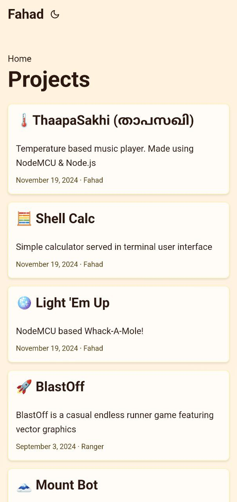
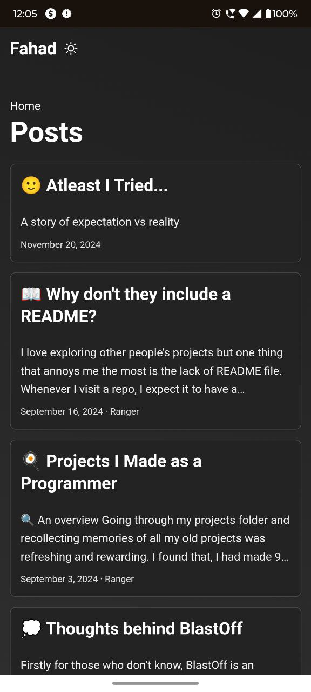

<p align="center">

</p>

<p align="center" style="font-size: 14px;">A personal Portfolio / Blogging website</p>

<p align="center">
    
</p>

<br/>

<p align="center">
    
    
    
    
</p>

> 🏗 Made using [Hugo](https://gohugo.io/) and [PaperMod](https://github.com/adityatelange/hugo-PaperMod/)

## Features of PaperMod/Hugo

- ✍ Support for markdown
- 🚧 Pre-built 404 page, home page, search, comments, analytics (Configurable)
- And many more...

## Features of The Breakthrough

- 🏠 Customized homepage (To fit my need)
- 🌈 Emojified interesting [content](https://thebreakthrough.netlify.app/posts/whats-breakthrough/)
- 📈 Integrated [GoatCounter](https://www.goatcounter.com/)

<hr>

## Guide

### How to view / run the website locally?

> [!IMPORTANT]
> Check out [Quick start guide](https://gohugo.io/getting-started/quick-start/) on hugo

1. Clone this repository

```
git clone https://github.com/Ranger-NF/Breakthrough
```

2. In the directory root, run

   ```
   hugo server -D
   ```
3. To publish the site, run

   ```
   hugo
   ```

   The files will be available in `public/` directory

### How to make a new blog post?

1. Create a new markdown file (eg: blog-title.md) in `content/posts/` directory.

> [!NOTE]
> You can nest directories the way you want. ie, if you want your blog path be like `website.xyz/awesome-series/blog` you would have to place your file in `content/posts/awesome-series/blog.md`

2. Add a [front matter](https://gohugo.io/getting-started/quick-start/#add-content) on top
3. Then, start writing your content using markdown.

<hr>

#### For more details, head over to [PaperMod wiki](https://github.com/adityatelange/hugo-PaperMod/wiki)
